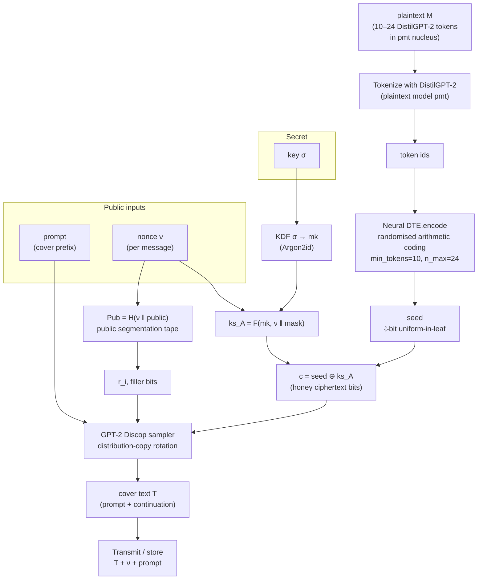
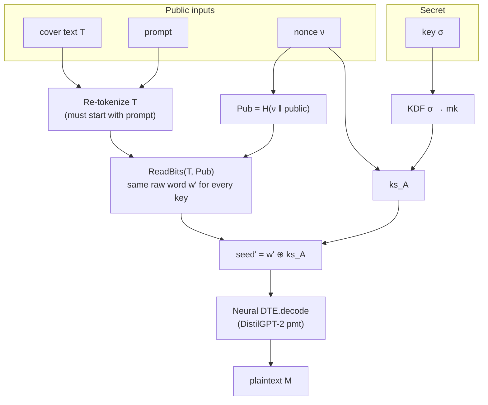
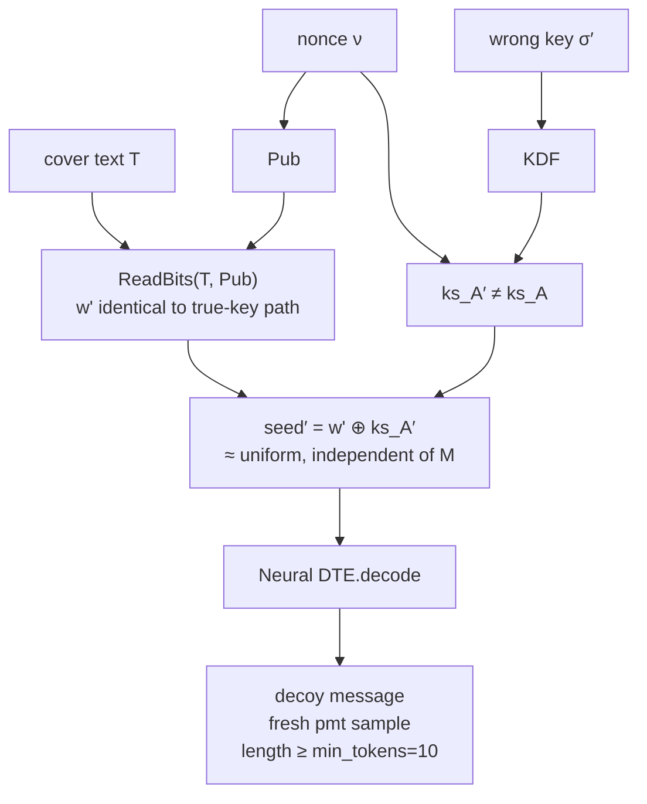
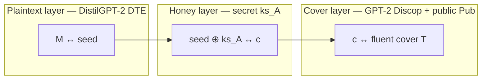

# Honey steganography — encode / decode flow

Editable source: this file is **Mermaid** inside Markdown.

- **Edit:** change the text in the ` ```mermaid ` blocks (VS Code preview, GitHub, Notion, Obsidian, etc.).
- **Tool:** [Mermaid Live Editor](https://mermaid.live) — paste a block, tweak, export SVG/PNG if needed.
- **Why Mermaid:** version-controllable, no proprietary binary; drag-and-drop alternatives (draw.io) are better for free-form posters, worse for git diffs.

Public values (travel with the cover, or are agreed out of band): **prompt**, **nonce** \(\nu\).  
Secret: **key** \(\sigma\) only.

---

## Encode (seal a message into cover text)



---

## Decode (true key — recover M)



---

## Wrong key (honey path — ≥10-token decoy)

Same cover \(T\), nonce, and prompt. Only the key differs.



Because segmentation is public, a wrong key **cannot** use bit-count as a correct-key test. After public extraction, honey is classical **DTE-then-OTP**.

---

## Layers at a glance

Exported PNG (for LinkedIn / posts): [`honey-layers.png`](honey-layers.png)  
Source: [`honey-layers.mmd`](honey-layers.mmd)



| Layer | Model | Secret? | Job |
|-------|--------|---------|-----|
| Plaintext DTE | DistilGPT-2 | no (public algorithm) | Map message ↔ uniform seed; wrong seeds → fluent decoys |
| Honey mask | Argon2id + PRF | **key** (+ nonce) | OTP so wrong keys see uniform seeds |
| Cover | GPT-2 Discop | no for `Pub`; mask only via \(c\) | Hide bits in innocent continuation of **prompt** |

---

## Editing tips

1. Open [mermaid.live](https://mermaid.live) and paste one `flowchart` block.
2. Or preview this file in VS Code (`Markdown: Open Preview`).
3. Keep node labels short; put detail in the tables above.
4. If you later want drag-and-drop: File → Export as SVG from mermaid.live, then import into [diagrams.net](https://app.diagrams.net).
